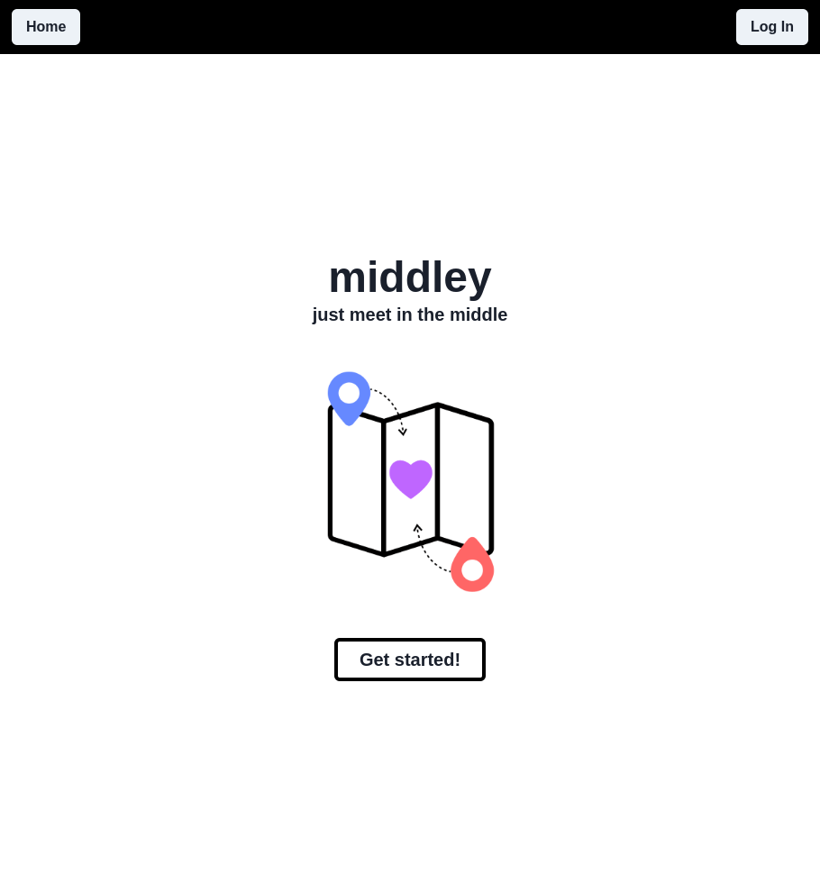
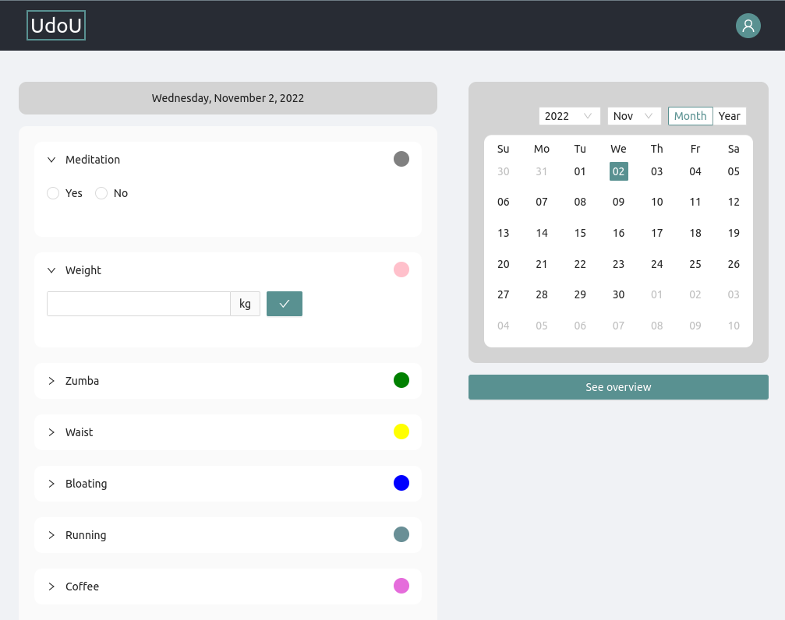
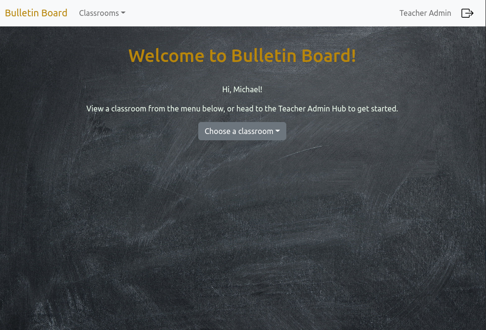

  <a href="https://www.linkedin.com/in/vicfb/">
  
  

    
  

      </a>

### About me   

:brain: :woman_scientist: I am a lifelong learner with a background in Biotechnology and Neuroscience  
:earth_americas: I've lived in 4 different countries and love working in an international environment  
:woman_technologist: I'm currently working on some full stack projects, check them out below!
💬 My pronouns are she/her  
📫 You can reach me on [LinkedIn](https://www.linkedin.com/in/vicfb/)

### Work in progress

<table>
<tr width="100%">
<td align="center" width="30%">

#### Middley

</td>

<td align="center" width="30%">

#### UdoU

</td>
<td align="center" width="30%">

#### Bulletin Board

</td>
</tr>
</table>
